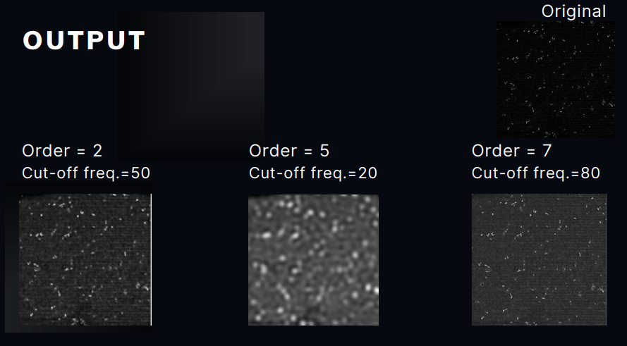

# Butterworth-Low-Pass-Filter
In this project, we develop a code using MATLAB in which we can observe filtering and smoothening of an image using butterworth filter.

**WHAT IS FILTERING AND SMOOTHENING?**

Many images have noise which creates blur and degrade the quality of image. Quality of image can be improved by using using filters.
Filtering is the process of removing unwanted noise from the image. Smoothening is the processof allowing the specific frequency-domain to pass through the filter.

Low Pass filtering helps in allowing the low frequency components of the image to pass through the filter. For  any image low frequency components are background
data shaded region etc.

**WHAT IS BUTTERWORTH LOWPASS FILTER?**

A Butterworth filter is a type of signal processing filter designed to have a frequency response as flat as possible in the passband. Hence the Butterworth filter is also 
known as “maximally flat magnitude filter”. Butterworth Lowpass Filter helps in Image smoothening by removing high frequency noise from digital image.

For the following image, we see how the order and cut-off frequency effects the filtering and smoothening factor.

